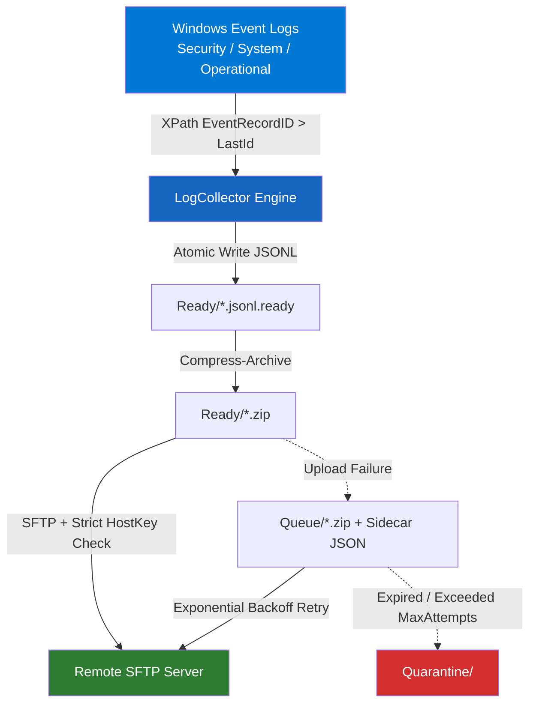

# WinLogCollector 🪟📋

> **Enterprise-grade Windows Log Collector Agent (v0.3.1)** – Academic Project CT491 - Core Computer Science Project

[🇬🇧 English Version](README.md) | [🇻🇳 Tiếng Việt](README_VN.md)

[](https://docs.microsoft.com/en-us/powershell/)
[](https://www.microsoft.com/windows)
[](tests/Unit/Collector.Tests.ps1)
[](LICENSE)

---

## 📌 Overview

**WinLogCollector** is a professional, reliable, and security-hardened Windows Event Log Collector agent designed for enterprise environments:
- **Incremental Collection**: Collects Windows Event Logs using **oldest-first paginated XPath queries** anchored on `RecordID` checkpoints (guaranteeing zero duplicate records and zero data loss).
- **Per-Channel Subscriptions**: Decouples event filtering into per-channel configuration arrays (`Subscriptions`).
- **Durable Outbox Crash Recovery**: Drains and recovers all pending `.ready` and `.zip` files at the beginning of every collection cycle.
- **Secure Compression & Upload**: Compresses logs into ZIP archives and uploads via OpenSSH SFTP with mandatory **`StrictHostKeyChecking=yes`** & host key verification.
- **Offline Resilient Queue**: Features exponential backoff retries, queue disk safety limits (`MaxSizeMB`), attempt caps (`MaxAttempts`), and automatic quarantining (`MaxAgeDays`).
- **Headless Core Architecture**: Core engine is 100% headless with zero WinForms dependency. Both GUI and Silent modes execute through a single unified entry point `Invoke-WinLogCollectorCycle`.

---

## 🏗️ System Architecture



---

## 📂 Project Structure

```
WinLogCollector/
├── Main.ps1                    # Orchestrator & Single Entry Point
├── config.json                 # JSON Configuration File (Host, Keys, Subscriptions...)
├── README.md                   # Documentation (English)
├── README_VN.md                # Documentation (Vietnamese)
├── LICENSE                     # Open-source MIT License
├── config/
│   └── config.schema.json      # JSON Schema validation
├── src/
│   ├── Core/
│   │   ├── LogCollector.ps1    # Incremental oldest-first Event Log collector
│   │   └── LogUploader.ps1     # Compression, SFTP upload & Queue management
│   ├── Gui/
│   │   └── MainWindow.ps1      # WinForms Management Console (receives Context hashtable)
│   └── Utils/
│       ├── Logger.ps1          # Thread-safe persistent JSON logger & UI callback sink
│       └── Security.ps1        # Admin check & Preflight check (Test-WinLogCollectorPrerequisite)
├── tests/
│   └── Unit/
│       └── Collector.Tests.ps1 # Pester Unit Tests suite
└── archive/                    # Archived legacy script iterations
```

---

## ⚙️ Configuration `config.json` (v0.3.1 Schema)

```json
{
  "Remote": {
    "Host": "192.168.1.100",
    "Port": 22,
    "User": "sftpuser",
    "SSHKeyPath": "C:\\ProgramData\\WinLogCollector\\keys\\id_rsa",
    "KnownHostsPath": "C:\\ProgramData\\WinLogCollector\\keys\\known_hosts",
    "RemotePath": "/var/log/collectors"
  },
  "Local": {
    "DataDir": "C:\\ProgramData\\WinLogCollector"
  },
  "Collection": {
    "DefaultIntervalMinutes": 3,
    "DefaultDurationMinutes": 9,
    "Subscriptions": [
      {
        "Channel": "Security",
        "EventIDs": [4624, 4625, 4688]
      },
      {
        "Channel": "System",
        "EventIDs": []
      },
      {
        "Channel": "Microsoft-Windows-PowerShell/Operational",
        "EventIDs": [4103, 4104]
      }
    ]
  },
  "Queue": {
    "MaxSizeMB": 2048,
    "MaxAttempts": 20,
    "MaxAgeDays": 14
  }
}
```

---

## �️ Interactive WinForms Management Console (6 Tabs)

| Tab | Name | Key Functionality |
|---|---|---|
| **1. 📊 Dashboard** | Overview & Quick Controls | Real-time KPI stat cards (Collected events, Queue size, SFTP status), Run Once, Continuous Timer Start/Stop, Preflight triggers. |
| **2. 📥 Collection** | Channel Subscriptions | Toggle between Checkpoint (incremental) and Lookback modes; interactive DataGridView for live channel & Event ID editing. |
| **3. ⚡ Automation** | Schedule & Continuous Timer | Configure interval cycle (minutes), live countdown timer display, and auto-retry offline queue buffer. |
| **4. 🌐 SFTP Setup** | Connection & Test Tools | Configure Host, Port, Username, RemotePath, SSH Key, KnownHosts; test TCP port 22 and save directly to `config.json`. |
| **5. 📦 Queue Buffer** | Offline Buffer & Quarantine | Interactive DataGridView listing queued `.zip` archives (Size, Attempts, Next Retry Time); manual Retry All Now & Open Folder actions. |
| **6. 🔍 Preflight Check** | System Prerequisites Audit | Interactive DataGridView evaluating 8 system prerequisites (Admin rights, `sftp.exe`, SSH Key, `known_hosts`, Event Channels, TCP port 22). |

---

## � Getting Started & Execution

### 1. Clone Repository & Setup
```powershell
git clone https://github.com/pthanhbinh1654/winlogcollector.git
cd winlogcollector
```

### 2. Launch GUI Management Console (Default Mode)
```powershell
powershell -ExecutionPolicy Bypass -File ".\Main.ps1"
```

### 3. Run Silent Mode (Headless / Windows Task Scheduler)
```powershell
powershell -ExecutionPolicy Bypass -File ".\Main.ps1" -Silent
```

### 4. Run Pester Unit Tests
```powershell
Invoke-Pester -Path ".\tests\Unit\Collector.Tests.ps1"
```

---

## 🔒 Security Hardening & Data Guarantees

1. **Strict Host Key Verification**: Enforces host fingerprint checking against `known_hosts` (mitigating Man-in-the-Middle risks).
2. **Atomic Disk Operations**: Writes to temporary files (`.tmp`) before moving to final `.ready`/`.queue.json` destinations to prevent race conditions.
3. **Single Instance Named Mutex**: Employs `Local\WinLogCollector` Named Mutex to prevent duplicate concurrent processes.
4. **Oldest-First RecordID Pagination**: Queries event logs chronologically from oldest to newest using EventRecordID, ensuring continuous recovery after reboots or downtime.
5. **Queue Disk Protection**: Freezes collection automatically when the offline queue reaches the `MaxSizeMB` threshold.

---

## 📝 License

Distributed under the **MIT License**. See [LICENSE](LICENSE) for details.

---
*CT491 Academic Project \| B2203708 – Phan Thanh Bình*
