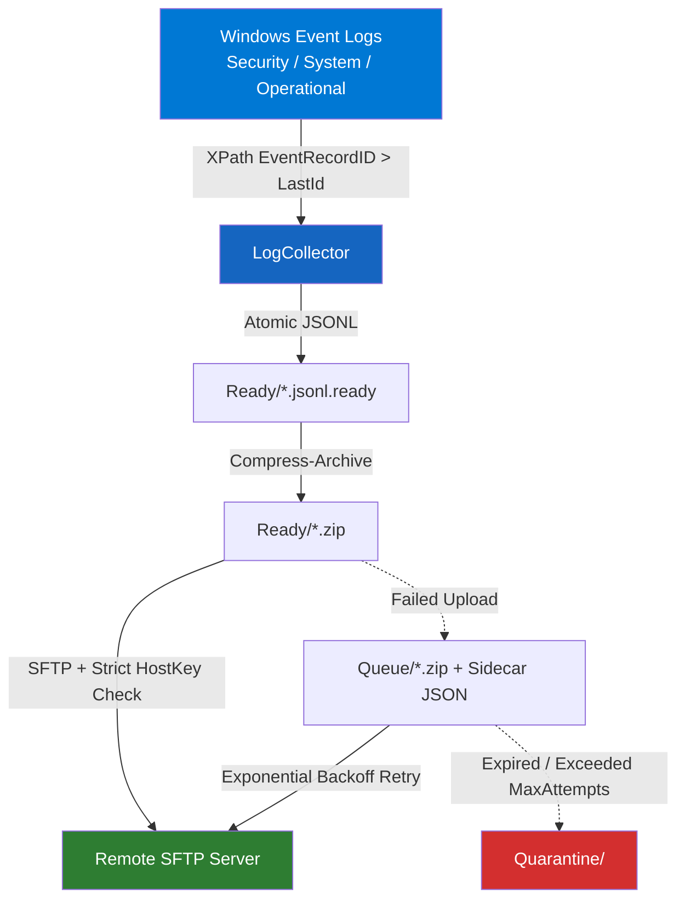

# WinLogCollector 🪟📋

> **Enterprise-grade Windows Log Collector Agent (v0.3.1)** – Đồ án CT491 - Niên Luận Cơ Sở

[](https://docs.microsoft.com/en-us/powershell/)
[](https://www.microsoft.com/windows)
[](tests/Unit/Collector.Tests.ps1)
[](LICENSE)

---

## 📌 Giới thiệu

**WinLogCollector** là một Windows Event Log Collector agent chuyên nghiệp, tin cậy và đạt chuẩn bảo mật, được thiết kế để:
- Thu thập Windows Event Logs theo **oldest-first paginated XPath query** dựa trên checkpoint `RecordID` (đảm bảo không trùng, không mất dữ liệu).
- Tách biệt cấu hình theo mảng **Subscriptions** cho từng Event Log Channel riêng biệt.
- **Tự động khôi phục sau crash (Durable Outbox)**: Xử lý cả file `.ready` và `.zip` còn tồn tại ở đầu mỗi chu kỳ.
- **Nén log & bảo mật truyền tải**: Nén ZIP và gửi lên máy chủ SFTP qua SSH Key với **`StrictHostKeyChecking=yes`** & host key verification.
- **Hàng chờ offline (Queue with Exponential Backoff & Quarantine)**: Giới hạn dung lượng Queue (`MaxSizeMB`), giới hạn số lần thử (`MaxAttempts`) và tự động đưa file quá hạn (`MaxAgeDays`) vào `Quarantine`.
- **Đã loại bỏ hoàn toànWinForms khỏi Core**: Core chạy headless 100%, GUI & Silent mode gọi chung một hàm duy nhất `Invoke-WinLogCollectorCycle`.

---

## 🏗️ Kiến trúc hệ thống



---

## 📂 Cấu trúc dự án

```
WinLogCollector/
├── Main.ps1                    # Orchestrator & Single Entry Point
├── config.json                 # File cấu hình JSON (Host, Keys, Subscriptions...)
├── README.md
├── LICENSE
├── config/
│   └── config.schema.json      # JSON Schema validation
├── src/
│   ├── Core/
│   │   ├── LogCollector.ps1    # Incremental oldest-first Event Log collector
│   │   └── LogUploader.ps1     # Compression, SFTP upload & Queue management
│   ├── Gui/
│   │   └── MainWindow.ps1      # WinForms UI (nhận Context hashtable)
│   └── Utils/
│       ├── Logger.ps1          # Thread-safe persistent JSON logger & UI callback sink
│       └── Security.ps1        # Admin check & Preflight check (Test-WinLogCollectorPrerequisite)
├── tests/
│   └── Unit/
│       └── Collector.Tests.ps1 # Pester Unit Tests suite
└── archive/                    # Mã nguồn cũ lưu trữ
```

---

## ⚙️ Cấu hình `config.json` (v0.3.1 Schema)

```json
{
  "Remote": {
    "Host": "192.168.1.100",
    "Port": 22,
    "User": "sftpuser",
    "SSHKeyPath": "C:\\ProgramData\\WinLogCollector\\keys\\id_rsa",
    "KnownHostsPath": "C:\\ProgramData\\WinLogCollector\\keys\\known_hosts",
    "RemotePath": "/var/log/collectors"
  },
  "Local": {
    "DataDir": "C:\\ProgramData\\WinLogCollector"
  },
  "Collection": {
    "DefaultIntervalMinutes": 3,
    "DefaultDurationMinutes": 9,
    "Subscriptions": [
      {
        "Channel": "Security",
        "EventIDs": [4624, 4625, 4688]
      },
      {
        "Channel": "System",
        "EventIDs": []
      },
      {
        "Channel": "Microsoft-Windows-PowerShell/Operational",
        "EventIDs": [4103, 4104]
      }
    ]
  },
  "Queue": {
    "MaxSizeMB": 2048,
    "MaxAttempts": 20,
    "MaxAgeDays": 14
  }
}
```

---

## 🚀 Hướng dẫn chạy & Kiểm thử

### 1. Clone Repo & Cài đặt
```powershell
git clone https://github.com/pthanhbinh1654/winlogcollector.git
cd winlogcollector
```

### 2. Chạy Giao diện GUI (Default Mode)
```powershell
powershell -ExecutionPolicy Bypass -File ".\Main.ps1"
```

### 3. Chạy Chế độ Silent (Headless Mode - Dùng cho Windows Task Scheduler)
```powershell
powershell -ExecutionPolicy Bypass -File ".\Main.ps1" -Silent
```

### 4. Chạy Unit Tests (Pester)
```powershell
Invoke-Pester -Path ".\tests\Unit\Collector.Tests.ps1"
```

---

## �️ Giao diện Quản trị WinForms (6 Tab)

| Tab | Chức năng | Chi tiết |
|---|---|---|
| **1. 📊 Tổng quan** | KPI Stat Cards & Điều khiển nhanh | Xem tổng số Event đã lấy, dung lượng Queue, trạng thái SFTP; nút Thu thập ngay, Bắt đầu/Dừng tự động, Preflight. |
| **2. 📥 Thu thập log** | Quản lý Subscriptions & Mode | Đổi giữa Checkpoint (incremental) và Lookback (phút); DataGridView chỉnh sửa trực tiếp danh sách Event Log Channels & Event IDs. |
| **3. ⚡ Tự động (Timer)** | Lịch chạy định kỳ Continuous Mode | Chỉnh chu kỳ Timer (phút), đếm ngược thời gian lần chạy kế tiếp, tự động retry queue đệm offline. |
| **4. 🌐 Cấu hình SFTP** | Cấu hình & Thử nghiệm kết nối | Thay đổi Host, Port, Username, RemotePath, SSH Key, KnownHosts; thử cổng TCP 22 & lưu cấu hình trực tiếp vào `config.json`. |
| **5. 📦 Hàng chờ Queue** | Quản lý đệm Offline & Quarantine | DataGridView danh sách file `.zip` đang chờ retry (Dung lượng, Số lần thử, Lần thử kế tiếp); nút Retry ngay & Mở thư mục. |
| **6. 🔍 Preflight Check** | Bảng kiểm tra tiền điều kiện | DataGridView kiểm tra 8 tiêu chí hệ thống (Admin, sftp.exe, SSH Key, KnownHosts, Event Channels, Cổng TCP 22). |

---

## �🔒 Tính năng Bảo mật & Độ tin cậy (Security & Invariants)

1. **Strict Host Key Verification**: Ép buộc kiểm tra fingerprint máy chủ qua file `known_hosts` (ngăn ngừa Man-in-the-Middle).
2. **Atomic Operations**: Ghi file tạm (`.tmp`) rồi đổi tên sang `.ready`/`.queue.json` để tránh race-conditions.
3. **Single Instance Mutex**: Sử dụng `Global\WinLogCollector` Named Mutex ngăn chạy nhiều tiến trình cùng lúc.
4. **Oldest-First RecordID Pagination**: Query log theo thứ tự từ cũ tới mới dựa trên EventRecordID, đảm bảo thu thập đầy đủ sau khi máy tắt hoặc gián đoạn.
5. **Disk Protection**: Tự động ngừng thu thập khi Queue vượt quá ngưỡng `MaxSizeMB` cấu hình.

---

## 📝 License

Dự án phát hành theo mã nguồn mở **MIT License**. Xem chi tiết tại [LICENSE](LICENSE).

---
*Đồ án CT491 – Niên Luận Cơ Sở \| B2203708 – Phan Thanh Bình*
