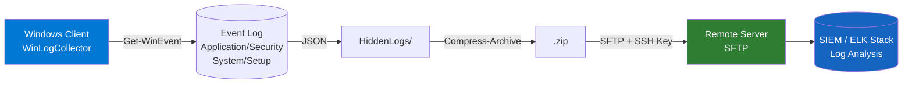

# WinLogCollector 🪟📋

> **He thong thu thap, nen va gui Windows Event Log qua SFTP** – Đồ án CT491

[](https://docs.microsoft.com/en-us/powershell/)
[](https://www.microsoft.com/windows)
[](LICENSE)

---

## 📌 Giới thiệu

**WinLogCollector** là một công cụ PowerShell dạng GUI cho phép quản trị viên:
- Thu thập Windows Event Log theo **khoảng thời gian** hoặc **liên tục theo chu kỳ**
- **Nén log** thành `.zip` trước khi gửi để tiết kiệm băng thông (~70%)
- **Gửi log tự động** lên máy chủ SFTP từ xa qua SSH Key
- **Lưu đệm offline** khi mất kết nối và **tự gửi lại** khi mạng phục hồi

---

## 🏗️ Kiến trúc hệ thống



---

## 📂 Cấu trúc dự án

```
WinLogCollector/
├── Main.ps1                    # Điểm khởi chạy chính
├── config.json                 # File cấu hình (IP, SSH key, paths...)
├── README.md
├── .gitignore
└── src/
    ├── Core/
    │   ├── LogCollector.ps1    # Thu thập & parse Event Log -> JSON
    │   └── LogUploader.ps1     # Nén zip + Upload SFTP + Retry queue
    ├── Gui/
    │   └── MainWindow.ps1      # Windows Forms GUI
    └── Utils/
        ├── Logger.ps1          # Logging ra GUI console + stdout
        └── Security.ps1        # Kiểm tra quyền Admin, ping test
```

---

## ⚙️ Yêu cầu hệ thống

| Yêu cầu | Chi tiết |
|---|---|
| OS | Windows 10/11 hoặc Windows Server 2016+ |
| PowerShell | 5.1 trở lên (có sẵn trên Windows) |
| Quyền | **Administrator** (bắt buộc để đọc Security Event Log) |
| OpenSSH | Cài đặt SFTP client (`sftp.exe`) – có sẵn từ Windows 10 1809+ |
| SSH Key | RSA private key để xác thực với SFTP server |

---

## 🚀 Hướng dẫn cài đặt & sử dụng

### 1. Clone repo
```powershell
git clone https://github.com/<username>/WinLogCollector.git
cd WinLogCollector
```

### 2. Cấu hình `config.json`
```json
{
  "Remote": {
    "Host": "192.168.1.2",
    "User": "sftp",
    "SSHKeyPath": "C:\\Users\\YourName\\.ssh\\sftp_id_rsa",
    "RemotePath": "/home/sftp/uploads"
  },
  "Local": {
    "FolderLuuLog": "C:\\"
  },
  "Collection": {
    "EventChannels": ["Application", "Security", "System", "Setup"],
    "DefaultIntervalMinutes": 3,
    "DefaultDurationMinutes": 9
  }
}
```

### 3. Chạy với GUI (mặc định)
```powershell
# Nhấp chuột phải -> "Run with PowerShell" hoặc:
powershell -ExecutionPolicy Bypass -File ".\Main.ps1"
```

### 4. Chạy không cần GUI (Silent mode – dùng cho Task Scheduler)
```powershell
powershell -ExecutionPolicy Bypass -File ".\Main.ps1" -Silent
```

### 5. Cài đặt chạy tự động với Windows Task Scheduler
```powershell
$action  = New-ScheduledTaskAction -Execute "powershell.exe" -Argument "-ExecutionPolicy Bypass -File `"C:\WinLogCollector\Main.ps1`" -Silent"
$trigger = New-ScheduledTaskTrigger -RepetitionInterval (New-TimeSpan -Minutes 3) -Once -At (Get-Date)
Register-ScheduledTask -TaskName "WinLogCollector" -Action $action -Trigger $trigger -RunLevel Highest -Force
```

---

## 🖥️ Giao diện ứng dụng

| Chức năng | Mô tả |
|---|---|
| **Limited Mode** | Thu thập log trong 1 khoảng thời gian cụ thể từ A đến B |
| **Continuous Mode** | Thu thập log định kỳ mỗi N phút, có thể dừng bất cứ lúc nào |
| **Kiem tra ket noi** | Ping kiểm tra kết nối SFTP server trước khi gửi |
| **Console Output** | Hiển thị log tiến trình realtime có mã màu |
| **Offline Buffer** | Tự lưu file zip khi mất kết nối, gửi lại khi online |

---

## 🔒 Bảo mật

- Sử dụng **SSH Key Authentication** (không dùng mật khẩu)
- File log được lưu trong **thư mục ẩn** (`HiddenLogs/`)
- Tùy chọn SFTP `-o StrictHostKeyChecking=no -o BatchMode=yes` đảm bảo chạy không tương tác
- SSH key **không được commit** vào repo (xem `.gitignore`)

---

## 📊 Các Event ID được hỗ trợ

| Event ID | Ý nghĩa | Trường bổ sung |
|---|---|---|
| **4624** | Đăng nhập thành công | AccountName, LogonType |
| **4688** | Tạo tiến trình mới | ProcessName, CommandLine |
| **4104** | PowerShell Script Block | ScriptBlockText |

---

## 📝 License

MIT License – Xem file [LICENSE](LICENSE) để biết thêm chi tiết.

---

*Đồ án CT491 – Niên Luận Cơ Sở | B2203708 – Phan Thanh Bình*
