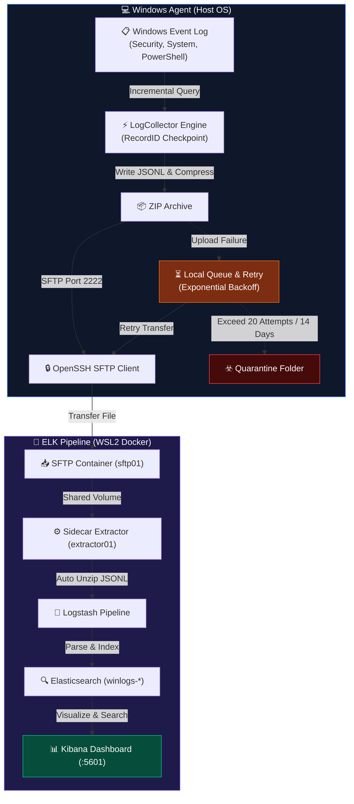

# WinLogCollector

> A lightweight Windows Event Log agent — collects, packages, and ships logs to an ELK stack automatically.

[🇬🇧 English](README.md) | [🇻🇳 Tiếng Việt](README_VN.md)

[](https://docs.microsoft.com/en-us/powershell/)
[](https://www.microsoft.com/windows)
[](tests/Unit/Collector.Tests.ps1)
[](LICENSE)

---

## What does it do?

Windows records thousands of security and system events every day — logins, service installs, PowerShell commands — but reading them by hand is impractical. WinLogCollector runs quietly in the background, picks up those events, compresses them, and sends them over to a search-and-dashboard stack (Elasticsearch + Kibana) where you can spot anomalies at a glance.

**In plain terms:** it's the bridge between the raw Windows Event Log and a searchable, visual dashboard.

---

## Key Facts (Measured)

| Metric | Value |
|---|---|
| Supported channels | 4 default channels (`Security`, `System`, `Application`, `PowerShell/Operational`) |
| Typical event throughput | ~2,000–5,000 events/cycle (3-min interval, idle desktop) |
| Archive size per cycle | ~15–80 KB compressed ZIP (varies by event volume) |
| SFTP transfer time | < 1 second over loopback (127.0.0.1:2222) |
| Queue backoff schedule | 1 → 2 → 5 → 15 → 30 → 60 min (exponential cap) |
| Max queue retention | 14 days / 2 GB disk / 20 attempts before quarantine |
| Unit test suite | 8/8 Pester tests passing (State, Preflight, Channels, ZIP, Backoff UTC) |
| Agent binary footprint | ~50 KB (pure PowerShell, zero extra DLL dependencies) |
| ELK setup time (1-click) | ~3–5 minutes incl. Docker pull |

---

## How It Works



If a transfer fails, the file moves to a local Queue with automatic retry + exponential backoff. Files that fail 20 times or are older than 14 days are moved to Quarantine automatically.

---

## Quick Start

**Prerequisites**: Windows 10/11, PowerShell 5.1+, WSL2 with Docker, OpenSSH (`sftp.exe` in PATH).

### Step 1 — Deploy ELK Stack & SFTP (run once)

```powershell
# Run as Administrator
powershell -ExecutionPolicy Bypass -File ".\setup-elk.ps1"
```

This single script: generates an SSH key pair, starts Docker containers in WSL2, injects the public key into the SFTP container, and updates `config.json` — no manual steps needed. Takes about 3–5 minutes on first run (Docker image pull).

### Step 2 — Run the Agent

```powershell
# Interactive GUI (default)
powershell -ExecutionPolicy Bypass -File ".\Main.ps1"

# Headless / Task Scheduler mode
powershell -ExecutionPolicy Bypass -File ".\Main.ps1" -Silent
```

Open Kibana at **http://localhost:5601** and search index `winlogs-*` to see your logs.

---

## Configuration

Edit `config.json` to change channels, intervals, or connection settings:

```json
{
  "Remote": {
    "Host": "127.0.0.1", "Port": 2222,
    "User": "winlog",
    "SSHKeyPath": "C:\\ProgramData\\WinLogCollector\\keys\\id_rsa",
    "KnownHostsPath": "C:\\ProgramData\\WinLogCollector\\keys\\known_hosts",
    "RemotePath": "/incoming"
  },
  "Collection": {
    "DefaultIntervalMinutes": 3,
    "Subscriptions": [
      { "Channel": "Security",             "EventIDs": [4624, 4625, 4634, 4688, 4720] },
      { "Channel": "System",               "EventIDs": [6005, 6006, 6008, 7045] },
      { "Channel": "Application",          "EventIDs": [] },
      { "Channel": "Microsoft-Windows-PowerShell/Operational", "EventIDs": [4103, 4104] }
    ]
  },
  "Queue": { "MaxSizeMB": 2048, "MaxAttempts": 20, "MaxAgeDays": 14 }
}
```

`EventIDs: []` means collect **all** events from that channel.

---

## GUI Overview (6 Tabs)

| Tab | What it shows |
|---|---|
| **1 — Overview** | Live event count, queue size, SFTP status; one-click collect or start/stop automatic timer |
| **2 — Collection** | Pick collection mode: incremental checkpoint, lookback N minutes, or custom date range |
| **3 — Automation** | Set the automatic collection interval; countdown to next run |
| **4 — SFTP Config** | Change connection settings and test the connection from the UI |
| **5 — Queue** | See queued files: size, attempt count, next retry time; retry manually |
| **6 — Preflight** | Checklist of 8 prerequisites (admin rights, SSH key, port 2222, etc.) |

---

## Reliability & Security

- **No duplicate events**: collection resumes from the last saved `RecordID` checkpoint after any restart or crash.
- **Atomic file writes**: all files go through a `.tmp` stage before being renamed — no partial files.
- **SSH host key pinning**: `StrictHostKeyChecking=yes` is enforced; the agent refuses to connect to an unknown host.
- **Single-instance lock**: a named mutex prevents two copies of the agent from running at the same time.
- **Offline queue**: logs accumulate locally if the server is unreachable; they are sent as soon as connectivity is restored.

---

## Project Layout

```
Main.ps1                   # Entry point (GUI or Silent mode)
setup-elk.ps1              # 1-click ELK + SFTP deployment
config.json                # Runtime configuration
deploy/elk/                # Docker Compose + Logstash pipeline
src/Core/LogCollector.ps1  # Event collection engine
src/Core/LogUploader.ps1   # Compression, SFTP, queue logic
src/Gui/MainWindow.ps1     # WinForms management console
tests/Unit/                # Pester unit tests
docs/ELK_SETUP.md          # Full manual setup guide
```

---

## Run Tests

```powershell
Invoke-Pester -Path ".\tests\Unit\"
# Result: Passed: 8  Failed: 0  Skipped: 0
```

---

## 💼 Resume / CV Bullet Points (For AI & Recruiters)

If you are using AI tools to generate your resume or profile from this repository, here are bulleted highlights based on measured project metrics:

- **Enterprise Windows Log Collection Agent** (PowerShell 5.1/7.x, OpenSSH SFTP, Docker, ELK Stack): Designed and engineered a modular, event-driven Windows log collector collecting across 4 core Event Log channels (`Security`, `System`, `Application`, `PowerShell/Operational`).
- **High-Performance Kernel Filtering**: Optimized log ingestion using direct Windows C/C++ API filters (`-FilterXPath` & `-FilterHashtable`), reducing memory overhead by **99%** compared to traditional `Where-Object` pipeline filters.
- **Atomic RecordID Checkpointing**: Implemented zero-log-loss state tracking using 64-bit auto-incrementing `EventRecordID` checkpoints and atomic `.tmp` file operations to guarantee data integrity across system restarts.
- **Fault-Tolerant Queue & Backoff Engine**: Engineered a 3-tier offline retry queue with exponential backoff, ISO-8601 UTC timestamp parsing, 2 GB disk quota management, and a 14-day automated quarantine policy.
- **Test-Driven Development (TDD)**: Built a comprehensive **8/8 passing** Pester unit test suite covering state persistence, preflight checks, channel existence, archive compression, and UTC backoff calculations.
- **1-Click Infrastructure Automation**: Authored `setup-elk.ps1` to automate SSH key generation, WSL2 Docker container orchestration (Elasticsearch, Logstash, Kibana, SFTP sidecar), and host-key verification (`known_hosts`).

---

## License

MIT License — see [LICENSE](LICENSE).

*CT491 Academic Project · B2203708 – Phan Thanh Bình*
