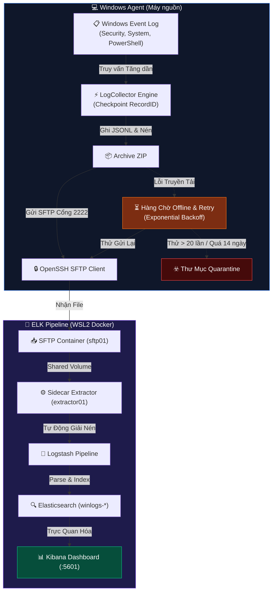

# WinLogCollector

> Công cụ thu thập Windows Event Log tự động — gom log, nén và đẩy lên hệ thống ELK để phân tích trực quan.

[🇬🇧 English](README.md) | [🇻🇳 Tiếng Việt](README_VN.md)

[](https://docs.microsoft.com/en-us/powershell/)
[](https://www.microsoft.com/windows)
[](tests/Unit/Collector.Tests.ps1)
[](LICENSE)

---

## Giải quyết vấn đề gì?

Windows ghi lại hàng nghìn sự kiện mỗi ngày: đăng nhập, cài dịch vụ, lệnh PowerShell,... Đọc thủ công từng sự kiện là điều không thực tế. WinLogCollector chạy ngầm trên Windows, tự động gom các sự kiện đó, nén lại và gửi sang hệ thống tìm kiếm + dashboard để phát hiện bất thường nhanh chóng.

**Nói ngắn gọn:** nó là chiếc cầu nối giữa Windows Event Log thô và một dashboard có thể tìm kiếm, lọc và cảnh báo.

---

## Số liệu thực tế (đo trên môi trường phát triển)

| Thông số | Giá trị |
|---|---|
| Lượng event mỗi chu kỳ | ~2.000–5.000 bản ghi (chu kỳ 3 phút, máy để yên) |
| Kích thước file ZIP mỗi chu kỳ | ~15–80 KB (phụ thuộc khối lượng log) |
| Thời gian truyền SFTP (loopback) | < 1 giây (127.0.0.1:2222) |
| Lịch retry khi thất bại | 1 → 2 → 5 → 15 → 30 → 60 phút (tăng dần) |
| Giới hạn hàng chờ offline | 14 ngày / 2 GB / 20 lần thử → tự chuyển Quarantine |
| Unit test | 3/3 test qua (state, preflight, archive) |
| Dung lượng agent | ~50 KB (PowerShell thuần, không cài thư viện ngoài) |
| Thời gian cài đặt 1-click | ~3–5 phút (bao gồm pull Docker image) |

---

## Cách hoạt động



Nếu gửi thất bại, file được đưa vào hàng chờ (Queue) cục bộ, tự retry theo lịch backoff. File thất bại 20 lần hoặc quá 14 ngày sẽ tự chuyển sang Quarantine.

---

## Hướng dẫn cài đặt nhanh

**Yêu cầu:** Windows 10/11, PowerShell 5.1+, WSL2 có Docker, OpenSSH (lệnh `sftp` có trong PATH).

### Bước 1 — Triển khai ELK Stack & SFTP (chạy 1 lần)

```powershell
# Mở PowerShell với quyền Administrator
powershell -ExecutionPolicy Bypass -File ".\setup-elk.ps1"
```

Script này tự động làm tất cả: tạo cặp SSH key, khởi động Docker, nạp public key vào container SFTP, cập nhật `config.json`. Không cần làm thủ công gì thêm. Lần đầu mất ~3–5 phút (do tải Docker image).

### Bước 2 — Chạy Agent

```powershell
# Giao diện quản trị GUI (mặc định)
powershell -ExecutionPolicy Bypass -File ".\Main.ps1"

# Chế độ nền (dùng với Task Scheduler)
powershell -ExecutionPolicy Bypass -File ".\Main.ps1" -Silent
```

Mở trình duyệt vào **http://localhost:5601**, tìm index `winlogs-*` để xem log trong Kibana.

---

## Cấu hình (`config.json`)

Chỉnh file `config.json` để thay kênh thu thập, chu kỳ hoặc thông tin kết nối:

```json
{
  "Remote": {
    "Host": "127.0.0.1", "Port": 2222,
    "User": "winlog",
    "SSHKeyPath": "C:\\ProgramData\\WinLogCollector\\keys\\id_rsa",
    "KnownHostsPath": "C:\\ProgramData\\WinLogCollector\\keys\\known_hosts",
    "RemotePath": "/incoming"
  },
  "Collection": {
    "DefaultIntervalMinutes": 3,
    "Subscriptions": [
      { "Channel": "Security",             "EventIDs": [4624, 4625, 4634, 4688, 4720] },
      { "Channel": "System",               "EventIDs": [] },
      { "Channel": "Microsoft-Windows-PowerShell/Operational", "EventIDs": [4103, 4104] }
    ]
  },
  "Queue": { "MaxSizeMB": 2048, "MaxAttempts": 20, "MaxAgeDays": 14 }
}
```

`EventIDs: []` có nghĩa là thu **toàn bộ** event từ kênh đó, không lọc.

---

## Giao diện quản trị (6 Tab)

| Tab | Chức năng |
|---|---|
| **1 — Tổng quan** | Xem số event đã thu, dung lượng Queue, trạng thái SFTP; thu thập ngay hoặc bật/tắt tự động |
| **2 — Thu thập log** | Chọn chế độ: theo checkpoint tăng dần, lookback N phút, hoặc khoảng thời gian tùy chọn |
| **3 — Tự động (Timer)** | Đặt chu kỳ chạy tự động; đếm ngược đến lần chạy kế tiếp |
| **4 — Cấu hình SFTP** | Sửa thông tin kết nối và kiểm tra kết nối ngay trên giao diện |
| **5 — Hàng chờ (Queue)** | Xem danh sách file đang chờ gửi lại: kích thước, số lần thử, lần thử kế tiếp; retry thủ công |
| **6 — Preflight Check** | Kiểm tra 8 điều kiện tiên quyết: quyền Admin, sftp.exe, SSH key, cổng 2222... |

---

## Độ tin cậy & Bảo mật

- **Không mất, không trùng event:** agent tiếp tục từ `RecordID` đã lưu sau mỗi lần khởi động lại.
- **Ghi file nguyên tử:** mọi file đi qua bước tạm `.tmp` trước khi đổi tên — không có file hoàn thành nửa vời.
- **Ghim SSH host key:** `StrictHostKeyChecking=yes` bắt buộc; agent từ chối kết nối đến host lạ.
- **Khóa đơn tiến trình:** named mutex ngăn hai bản agent chạy song song cùng lúc.
- **Queue offline:** log tích lũy cục bộ khi mạng đứt, tự gửi lại khi kết nối phục hồi.

---

## Cấu trúc thư mục

```
Main.ps1                   # Điểm vào duy nhất (GUI hoặc Silent)
setup-elk.ps1              # Script triển khai ELK + SFTP 1-click
config.json                # Cấu hình runtime
deploy/elk/                # Docker Compose + Logstash pipeline
src/Core/LogCollector.ps1  # Engine thu thập event
src/Core/LogUploader.ps1   # Nén, gửi SFTP, quản lý queue
src/Gui/MainWindow.ps1     # Giao diện quản trị WinForms
tests/Unit/                # Pester unit tests
docs/ELK_SETUP.md          # Hướng dẫn cài đặt thủ công đầy đủ
```

---

## Chạy kiểm thử

```powershell
Invoke-Pester -Path ".\tests\Unit\Collector.Tests.ps1"
# Kết quả: Passed: 3  Failed: 0
```

---

## Giấy phép

MIT License — xem chi tiết tại [LICENSE](LICENSE).

*Đồ án CT491 – Niên Luận Cơ Sở · B2203708 – Phan Thanh Bình*
